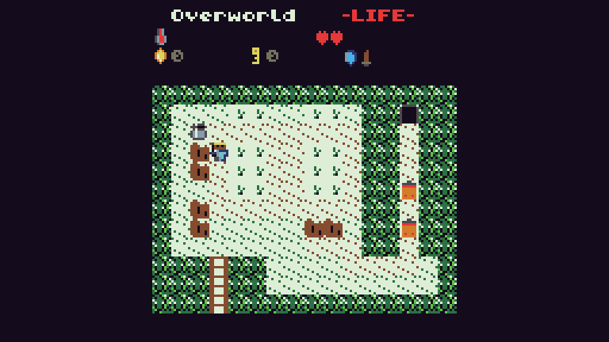

# TIC-80 Cartridges from 2018

  

An archive for my games from the time I started learning programming in JavaScript.
From a time where I didn't know anything about design patterns, naming conventions and other
essential tools to make code reusable and more readable.

You can play the demos in you Browser if you want:
- _**[Kurse of Kildren](https://tic80.com/play?cart=557)**_
- _**[2048](https://tic80.com/play?cart=395)**_
- _**[Match 3](https://tic80.com/play?cart=534)**_